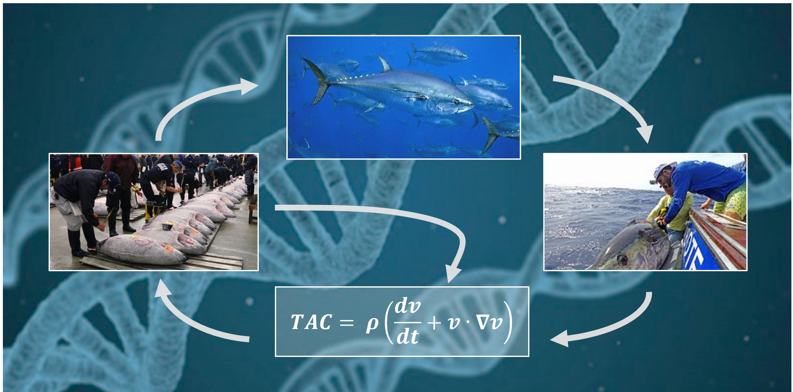

&nbsp;


&nbsp;


&nbsp;

<style>
  .col2 {
    columns: 2 200px;         /* number of columns and width in pixels*/
    -webkit-columns: 2 200px; /* chrome, safari */
    -moz-columns: 2 200px;    /* firefox */
  }
  .col3 {
    columns: 3 100px;
    -webkit-columns: 3 100px;
    -moz-columns: 3 100px;
  }
  .col4 {
    columns: 4 100px;
    -webkit-columns: 4 100px;
    -moz-columns: 4 100px;
  }
</style>

```{r setup, include=FALSE}
library(dplyr)
library(knitr)
knitr::opts_chunk$set(echo = FALSE)


```
***

### Project details

```{r ProjDets, eval=T}
dat<-data.frame(c("Funding body","Funding stream","NOAA Award Number",
"Request for proposals","Project Partners","Collaborators"),
                 c("U.S. National Oceanic and Atmospheric Administration",
                   "FY21 Bluefin Tuna Research Program",
                   "NA21NMF4720304",
                   "NOAA-NMFS-SE-2021-2006574",
                   "The Ocean Foundation, Blue Matter Science Ltd.",
                   "Tom Carruthers, Shana Miller, Matt Lauretta, Doug Butterworth, Ann Preece, Richard Hillary"))

kable(dat,col.names=rep("",2)) 
 

```

&nbsp;
&nbsp;


***

### Project description

The objective of this project is to use existing operating models for Atlantic bluefin tuna to evaluate the potential performance of harvest strategies that use conventional gene tagging data. 

(more detail and references to come)

&nbsp;
&nbsp;

***

### Project status (~30%)

Completed so far:

* An individual tagging model has been integrated into the the MSE framework
* Observed tag histories are now available to MPs for the setting of management advice
* A preliminary TMB Brownie estimator has been developed and tested 

Next steps: 

1. testing of harvest rate / abundance estimators based on simulated tag histories
2. generate a set of tag release designs and codify these into the package (class GT)
3. Modify the MSE code to only do GT calcualtions if a GT management procedure is specified
4. Develop alternative mark-recapture estimators of harvest rate and abundance

&nbsp;
&nbsp;

***

### Links 

<div class="col2">

[ABTGT GitHub Repository](https://github.com/Blue-Matter/ABTGT/)

[Draft paper (private Google Doc for collaborators)](https://docs.google.com/document/d/1DduUQIQQrJFBXquaoPXIjKMvuVVZMYQf9H6phEI_uGQ/edit?usp=sharing)

[Atlantic bluefin tuna MSE framework and operating models](https://iccat.github.io/abft-mse/)


</div>

&nbsp;
&nbsp;

***

### Demonstration Code

```{r demo, echo=TRUE, eval=FALSE}

library(ABTMSE) # The ABT MSE R package
library(ABTGT)  # The ABT Gene Tagging package
loadABT()       # Load all MSE objects (OMs, observation error models etc)


OM<-OM_1d       # A small (four simulation) version of the stochastic reference case operating model
GT <- make_GT(OM,nT=10000)                      # make a gene tagging object that defines the release design
test<-new('MSE_GT',OM,list(c("U5","U5")),GT=GT) # makes a dataset that includes tag histories

dset[[1]]$TH # tag histories
dset[[1]]$CN # observed catch numbers
dset[[1]]$N # true simulated numbers at age

  
```


&nbsp;
&nbsp;


***
### References

[NOAA BTRP](https://www.fisheries.noaa.gov/grant/bluefin-tuna-research-program)

[The Ocean Foundation](https://oceanfdn.org/)

[Blue Matter](https://www.bluematterscience.com/)

&nbsp;
&nbsp;

***

### Acknowledgements

This work was funded by a US National Oceanic and Atmospheric Adiministration grant.


&nbsp;
&nbsp;
&nbsp;
&nbsp;
&nbsp;
&nbsp;

