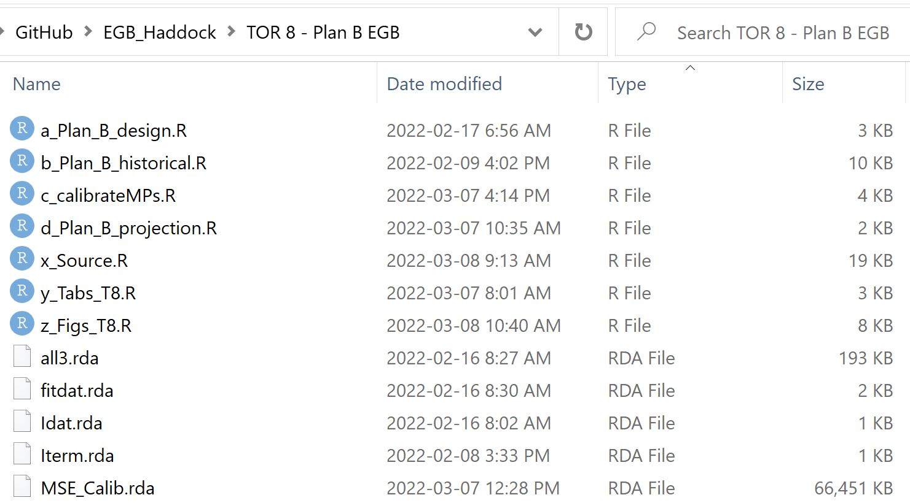

&nbsp;

 

&nbsp;

<style>
  .col2 {
    columns: 2 200px;         /* number of columns and width in pixels*/
    -webkit-columns: 2 200px; /* chrome, safari */
    -moz-columns: 2 200px;    /* firefox */
  }
  .col3 {
    columns: 3 100px;
    -webkit-columns: 3 100px;
    -moz-columns: 3 100px;
  }
  .col4 {
    columns: 4 100px;
    -webkit-columns: 4 100px;
    -moz-columns: 4 100px;
  }
</style>

```{r setup, include=FALSE}
library(dplyr)
library(knitr)
knitr::opts_chunk$set(echo = FALSE)


```

***

### Software

&nbsp;

#### Wood's Hole Assessment Model (WHAM)

For more information about WHAM you can go to [the WHAM homepage](https://brianstock.github.io/wham/)

or read the peer-reviewed paper by [Stock and Miller 2021](https://www.sciencedirect.com/science/article/pii/S0165783621000953)

&nbsp;

#### OpenMSE

For more information about the OpenMSE software (Hordyk et al.) used in reference point calculation, projection and plan-B testing visit [the openMSE homepage](https://openMSE.com). 

The operating model equations are identical to those detailed in the appendices of the peer-reviewed paper for DLMtool [Carruthers & Hordyk 2019](https://besjournals.onlinelibrary.wiley.com/doi/full/10.1111/2041-210X.13081)

&nbsp;
&nbsp;

***


### R Code 

R code for TOR 4 (Assessment), TOR 6 (Projection), TOR 8 (Plan - B assessment), TOR 11 (Reference points) is available from a [private GitHub repository](https://github.com/Blue-Matter/EGB_Haddock/)

Please email tom@bluematterscience or failing that, quang@bluematterscience for access to the repository. 

The repo has the following folder structure:


```{r ProjDets, eval=T}
dat<-data.frame(c("/Data","/Figures","/Tables","/TOR 4 i - Standard SCA","/TOR 4 ii - Time Varying Survival","/TOR 4 iii - Sim testing","/TOR 4 iv - Base EGB model","/TOR 4 v - Fit Retro Estimates","/TOR 4 vi - Sensitivity Base EGB","/TOR 6 Projections","/TOR 8 - Plan B EGB","/TOR 11 i - Make EGB OM","/TOR 11 ii - Reference points EGB", "/VPA","/WHAM","/Z - Old scripts"),

                 c("Raw and processed data used in the fitting of assessments and production of operating models",
                   "TOR 4, 6, 8 and 11 Figures",
                   "TOR 4, 6, 8 and 11 Tables",
                   "Specification & fitting of 'standard' statistical catch at age WHAM models without time varying M",
                   "Specification & fitting of WHAM models including time varying M",
                   "Simulation self-testing of time varying M models",
                   "Specification, fitting and generic wham report building for the Base (Mest) assessment model including jitters",
                   "Plotting of fitting diagnostics, M LHF profiling, retrospective diagnostics and model estimates",
                   "Specification, fitting & results of sensitivity analyses for the Base (Mest) assessment model",
                   "Projection of Base (Mest) assessment model including TAC alternatives and risk profiles",
                   "Closed-loop simulation testing of existing and new management procedures for EGB haddock including plan-B-smooth",
                   "Specification of openMSE operating models for the Base (Mest) assessment for the purposes of reference point calculation, projections and plan-B MP evaluation",
                   "Code to investigate alternative reference points for EGB haddock including FXSPR ref points",
                   "Code and documentation for the continuity VPA run",
                   "Additional code and data to support EGB assessment",
                   "Disused code for reference"))

kable(dat,col.names=c("Folder","Contents")) 
 

```

&nbsp;
&nbsp;


Within each folder there are calculation scripts starting a_, b_ etc and then source code, Tabulation and Figure scripts (x_, y_, z_).



To run through the various analyses, first run the Dependencies.R script in the base directory.

The correct order to run through the scripts from scratch is:

* TOR 4 i-vi (assessment) 
* TOR 11 i & ii (reference points), 
* TOR 6 (projections - uses operating model and reference points from TOR 11)
* TOR 8 (plan B - uses operating model and reference points from TOR 8)

&nbsp;
&nbsp;

***

### Further details on the Base (Mest) model

A full set of detailed diagnostics and model estimates are available in the form of the default wham plotting figures which are available [here](https://drive.google.com/drive/folders/1AgzaUH1UK0_JPme2MCRSvpI1wTHroNKS?usp=sharing)

&nbsp;
&nbsp;

***

### Background information

A summary of the [rejected 2019 VPA asssessment](Reports/TSR_2019_EGBHAD_FINAL_CDN Approved.pdf)

Proceedings of the 2019 Transboundary Resources Assessment Committee for Eastern Georges Bank Cod and Haddock, and Georges Bank Yellowtail Flounder [NOAA status report](Reports/2019_Proceedings_noaa_24762_DS1.pdf)

&nbsp;
&nbsp;

***


### Tables and Figures presented in TORs 4, 6, 8 and 11

The excel tables and jpg figures are available in a public [google drive folder](https://drive.google.com/drive/folders/12ApfuSqkCV5rwY0N7f9buK2xZNom1erB?usp=sharing)

&nbsp;
&nbsp;

***

### Acknowledgements

The EGB Assessment is a product of the Haddock working group and has benefited from the input of Brian Linton (chair), Liz Brooks, Charles Perretti, Jamie Cournane, Kevin Friedland, Scott Large, Steve Cadrin, Michele Traver, Tara Trinko and Larry Alade. 

Special thanks goes to the Canadian DFO team that have worked in close coordination in the production of the EGB TORs: Monica Finley, Yanjun Wang, Tara McIntyre, Tim Barrett, Kathryn Cooper-MacDonald and Michelle Greenlaw. 

Special thanks also to Tim Miller and Brian Stock for their help getting to grips with their excellent WHAM package.


&nbsp;
&nbsp;
&nbsp;
&nbsp;
&nbsp;
&nbsp;

